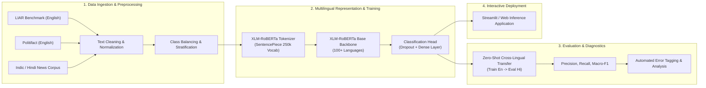

<div align="center">

# 🌐 Cross-Lingual Fake News Detection
### Multilingual Misinformation Detection using XLM-RoBERTa

[](https://python.org)
[](https://pytorch.org)
[](https://huggingface.co)
[](https://huggingface.co/xlm-roberta-base)
[](https://streamlit.io)
[](LICENSE)

<p align="center">
  <b>A cross-lingual NLP pipeline:</b> Detecting misinformation and fabricated claims across diverse languages (English, Hindi, and low-resource Indic languages) by leveraging shared multilingual semantic representations in cross-lingual transformer models.
</p>

</div>

---

## 📌 Project Overview

Online misinformation spreads rapidly across linguistic boundaries, while fact-checking resources are overwhelmingly concentrated in English. This project builds a **Cross-Lingual Fake News Detection** framework based on **XLM-RoBERTa (Cross-lingual RoBERTa)**.

By fine-tuning multilingual contextual language representations, the model learns shared semantic boundaries of deception, allowing effective **zero-shot cross-lingual transfer** from high-resource languages (English) to low-resource languages (Hindi and regional languages) without requiring extensive translated training sets.

---

## 🏗️ End-to-End Pipeline



---

## ✨ Key Features

- **Multilingual Semantic Embeddings**: Utilizes `xlm-roberta-base` trained on 2.5TB of filtered CommonCrawl data across 100 languages.
- **Zero-Shot Cross-Lingual Evaluation**: Validates the model's ability to classify Hindi and bilingual claims after training primarily on structured English datasets.
- **Robust Preprocessing Pipeline**: Scripts for token normalization, label remapping (binary & multi-class), class balancing, and dataset merging.
- **Error Analysis Suite**: Automated failure-case tagging (`scripts/auto_error_tag.py`) to diagnose linguistic ambiguity, length sensitivity, and cultural bias.
- **Interactive Inference App**: Lightweight web interface (`scripts/app.py`) for real-time article verification and confidence breakdown.

---

## 📊 Experimental Setup & Hyperparameters

Configured in [`config.yaml`](config.yaml):

| Parameter | Default Value | Description |
|---|---|---|
| **Base Model** | `xlm-roberta-base` | Pretrained multilingual transformer |
| **Train Batch Size** | `8` | Effective per-device training batch size |
| **Eval Batch Size** | `8` | Validation evaluation batch size |
| **Learning Rate** | `2e-5` | AdamW optimizer initial learning rate |
| **Epochs** | `3` | Full training passes with linear warmup |
| **Max Sequence Length** | `256 / 512` | Token sequence cutoff |

---

## 🚀 Quickstart Guide

### 1. Environment Setup
```bash
# Clone the repository
git clone https://github.com/mahirbhat70-eng/cross-lingual-fake-news-detection.git
cd cross-lingual-fake-news-detection

# Create and activate a virtual environment
python -m venv .venv
# On Windows:
.\.venv\Scripts\Activate.ps1
# On Linux/macOS:
source .venv/bin/activate

# Install dependencies
pip install -r requirements.txt
```

### 2. Dataset Preparation
Place datasets under `data/dataset/`:
- **LIAR Dataset**: `data/dataset/liar/`
- **Hindi Corpus**: `data/dataset/hindi/`
- **Politifact**: `data/dataset/politifact/`

Run preprocessing and dataset alignment:
```bash
python scripts/convert_liar_to_binary.py
python scripts/fix_hindi_dataset.py
python scripts/balance_dataset.py
```

### 3. Model Training
```bash
python src/train.py
```

### 4. Cross-Lingual Evaluation & Diagnostics
```bash
# Evaluate Macro-F1 across languages
python scripts/eval_f1.py

# Evaluate zero-shot cross-lingual transfer
python scripts/evaluate_zeroshot.py

# Generate automated error tagging report
python scripts/auto_error_tag.py
```

### 5. Run Prediction & Interactive Demo
```bash
# Run CLI prediction on a sample article
python src/predict.py --text "Breaking: Scientists confirm water found on new terrestrial planet."

# Launch the interactive web app
python scripts/app.py
```

---

## 📂 Repository Structure

```text
cross-lingual-fake-news-detection/
├── config.yaml               # Training, tokenizer, and hyperparameter configuration
├── requirements.txt          # Python dependencies (PyTorch, Transformers, Datasets, etc.)
├── src/
│   ├── train.py              # Model fine-tuning script with Trainer API
│   ├── evaluate.py           # Multi-metric validation routine
│   └── predict.py            # Single-text and batch inference pipeline
├── scripts/
│   ├── app.py                # Interactive web interface for inference
│   ├── evaluate_zeroshot.py  # Cross-lingual zero-shot transfer evaluation
│   ├── eval_f1.py            # F1 score and confusion matrix reporting
│   ├── auto_error_tag.py     # Automated error pattern classification
│   ├── balance_dataset.py    # Class balance and resampling utilities
│   └── prepare_liar.py       # Benchmark dataset parsers
├── notebooks/                # Exploratory data analysis and training experiments
├── docs/                     # Detailed project notes and experiment summaries
└── data/                     # Raw and processed datasets (git-ignored for security)
```

---

## 📄 License
This project is open-source and available under the [MIT License](LICENSE).
